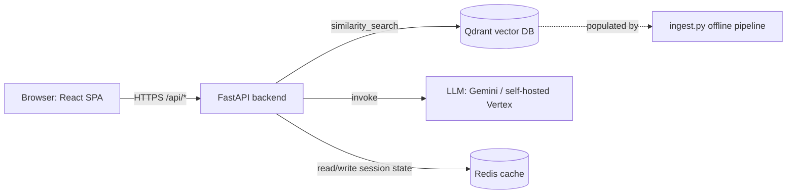
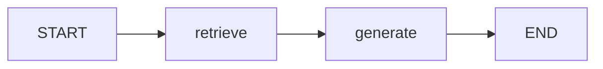

# PAUHelper (BasicRAGapp) — Technical How It Works

*Reference document to feed into another AI tool for PDF generation, for the "How it works" panel. Purely technical: what the app is built to do, and how each layer works, split into Infrastructure, Backend, and Frontend.*

---

## 1. What the App Does

PAUHelper is a **Retrieval-Augmented Generation (RAG) web application**. It lets a student pick an autonomous community (region), subject, and language, then chat (text and/or image) with an LLM whose answers are grounded in a **vector database of curriculum-specific document chunks** retrieved per subject/region, rather than the model's raw parametric knowledge alone.

At a system level, one request does the following:

---

## 2. Infrastructure Layer

**Provisioning**: Terraform, under [infra/environments/prod](../infra/environments/prod) composing reusable modules from [infra/modules](../infra/modules).

- **Networking**: a dedicated VPC (`module.vpc`) with one subnet. All compute lives inside this private network; nothing except explicitly allowed ports is internet-reachable.
- **Vector database host** (`module.qdrant_server`): a single `e2-micro` Compute Engine VM running the `qdrant/qdrant` Docker image via a startup script, protected by an API key (`QDRANT__SERVICE__API_KEY`) and a firewall rule (`module.qdrant_firewall`) that only allows TCP 6333/6334 from explicitly approved source ranges — not the open internet.
- **Serverless VPC Access connector** (`module.run_vpc_connector`): lets the stateless Cloud Run service reach Qdrant's *internal* IP directly, so Qdrant never needs a public IP. A second firewall rule (`qdrant_firewall_from_connector`) scopes access to the connector's CIDR only.
- **Application runtime** (`module.app_service`, `infra/modules/cloud_run_service`): Google Cloud Run running the combined frontend+backend Docker image, `allow_unauthenticated = true` (public HTTPS endpoint), auto-scaling, stateless.
- **Identity & access (least privilege)**: three dedicated service accounts, each scoped to only what it needs:
  - `qdrant_vm_sa` — logging + monitoring write only.
  - `asset_uploader_sa` — object-admin, scoped to the docs bucket only (not project-wide storage).
  - `app_sa` (used by Cloud Run) — logging write, `roles/aiplatform.user` (to call Vertex AI), and object-viewer scoped to the docs bucket only.
- **Storage**: a GCS bucket (`module.docs_bucket`) holds source documents/prompt assets, populated via `module.docs_files` (idempotent object uploads).
- **Container registry**: `module.app_images`, an Artifact Registry repository with a cleanup policy that automatically prunes old image versions (keeps the most recent 2).
- **Secrets**: `secret_manager_secret` / `secret_manager_secret_iam` modules manage sensitive values (API keys) outside of plain Terraform variables/state where applicable.
- **CI/CD**: a single GitHub Actions workflow (`terraform-apply.yaml`) triggered on PR merge to `main` — builds and pushes the Docker image, runs `terraform apply` (which deploys that exact image to Cloud Run, no manual step), then prunes old Cloud Run revisions via `gcloud run revisions list/delete` (keeps last 2).

**Environment wiring passed into the running container** (via Cloud Run env vars, see `app_service.env`): `GOOGLE_CLOUD_PROJECT/LOCATION`, `LLM_MODEL`, `EMBEDDING_MODEL`, `VECTOR_DB_TYPE=qdrant`, `QDRANT_HOST` (Qdrant VM's internal IP), `QDRANT_PORT`, `QDRANT_API_KEY`, `GEMINI_API_KEY`, `GCS_BUCKET_NAME`, `MODE=GCP`.

---

## 3. Backend Layer (FastAPI, Python)

**Entry point**: [src/app.py](../src/app.py) → [src/api/app.py](../src/api/app.py) (composition root).

### 3.1 Application lifecycle
On startup (`lifespan` context manager):
1. Loads the embeddings model once (warms it up so the first real request isn't slow).
2. Opens a test connection to Qdrant and logs the collection count, to fail fast/loud if the vector DB is unreachable.
On shutdown: clears two in-memory caches (`graph_instance_cache`, `graph_config_cache`).

### 3.2 API surface
All routers are mounted under the `/api` prefix:

| Route | Purpose |
|---|---|
| `GET /api/` | Health check + cache diagnostics |
| `GET /api/config?language=ES\|EN` | Returns the list of regions/subjects/labels for the UI, localized |
| `POST /api/create_system` | Initializes (or reuses, from cache) a subject+region-specific RAG pipeline for a session |
| `POST /api/chat` | Sends a user turn (text and/or image) and returns the assistant's answer + sources |

For single-container deployments, FastAPI also serves the built frontend: static assets are mounted at `/assets`, and a catch-all route serves `index.html` for any other path (SPA client-side routing fallback), only when a `frontend_dist/` folder is present (built by the Docker frontend stage).

### 3.3 Session / graph creation (`POST /create_system`)
File: [src/system/create_system/create_system.py](../src/system/create_system/create_system.py)

1. Builds a `cache_key` from `session_id + category (region) + subject`.
2. If a graph config for that key is already cached, reuses it (`ensure_cached_graph`).
3. Otherwise builds a brand-new LangGraph pipeline (`initialize_and_cache_graph` → `create_system(subject, community)`) and stores it in an in-memory `graph_instance_cache`, plus persists its config so it can be recovered after a restart.

### 3.4 The RAG pipeline itself (LangGraph)
File: [src/utils/create_system/graph.py](../src/utils/create_system/graph.py)

For each `(subject, community)` pair, a small **2-node LangGraph state machine** is compiled:

- **`retrieve` node**: takes the latest human message, embeds it (same embeddings model/space used at ingestion time), and runs `vector_store.similarity_search(query, k=4)` against the Qdrant collection resolved for that subject (`resolve_collection(subject)`). Returns the top 4 matching chunks.
- **`generate` node**: concatenates the retrieved chunks into a context block, prepends a subject/region-specific **system prompt** (loaded from [prompts/](../prompts) via `load_system_prompt`), and invokes the LLM with the full running message history.
- **LLM selection**: uses a self-hosted Vertex AI endpoint if configured (`VertexSelfDeployedLLM`), otherwise falls back to Google's Gemini API (`ChatGoogleGenerativeAI`, model from `LLM_MODEL` env var, e.g. `gemini-2.5-flash-lite`).

### 3.5 Chat turn execution (`POST /chat`)
File: [src/system/chat/chat.py](../src/system/chat/chat.py)

1. Resolves the same `cache_key` and fetches (or lazily rebuilds) the cached graph via `ensure_graph_available`.
2. Builds the message content from the text query; if an image is attached, decodes/validates it, builds a data URL, and runs a separate image-description call (`image_read`) so the image content can also feed short-term memory context — with graceful fallback if that call fails.
3. Loads prior conversation memory/summary for the session (`load_memory_context`) from **Redis** ([src/utils/cache](../src/utils/cache): `session_memory.py`, `conversation_memory.py`).
4. Assembles the LangGraph input state (system/language instruction + memory summary + recent turns + new message).
5. Counts tokens before/after via `get_token_counter()` for observability.
6. Streams the graph execution (`run_graph_stream`), which runs `retrieve → generate` and returns the answer text, step count, and the raw retrieved documents.
7. Builds a `sources` list from the retrieved documents (`build_sources`) so the frontend can show what was consulted.
8. Persists the updated memory/summary and logs token usage (`update_memory_and_log`).
9. Returns `{ response, sources }` as JSON.

### 3.6 Ingestion pipeline (offline, populates the vector DB)
File: [vector_db/ingest.py](../vector_db/ingest.py)

- Walks the [content/](../content) folder tree (one subfolder per subject); the folder name becomes the Qdrant collection name.
- Loads PDFs (`PyPDFLoader`), splits them into chunks (`RecursiveCharacterTextSplitter`), normalizes whitespace (`clean_text`).
- Computes a SHA-256 hash per file to make re-ingestion idempotent — unchanged files are skipped, changed files' stale chunks are deleted and replaced (`delete_stale_chunks`), matched by relative path and chunk index.
- Embeds each chunk with `ModernGeminiEmbeddings` (custom LangChain `Embeddings` wrapper around Vertex AI's `embed_content`, using `task_type=RETRIEVAL_DOCUMENT` for chunks and `RETRIEVAL_QUERY` at query time — same model, same vector space).
- Upserts embeddings + metadata into the collection via `vector_db/manager.py` (`QdrantVectorDB`, auto-creates the collection with the correct vector size/distance metric — cosine — if it doesn't exist yet).
- Uploads/verifies the same source files in Google Cloud Storage as a durable backup (`_upload_blob`, retried with exponential backoff, generation-matched for concurrency safety).

### 3.7 Caching & memory
- **`graph_instance_cache` / `graph_config_cache`** (in-process, cleared on shutdown): avoid rebuilding a LangGraph pipeline (embeddings + vector store handle + LLM client) on every request for the same subject/region/session.
- **Redis** ([src/utils/cache/redis_client.py](../src/utils/cache/redis_client.py)): durable-ish session memory across restarts — conversation summaries and recent turns per `cache_key`, so a student's chat has continuity.

### 3.8 Observability
[src/utils/observability](../src/utils/observability) provides a token counter used to log input/output token counts per turn, useful for cost monitoring and debugging prompt size.

---

## 4. Frontend Layer (React + Vite)

**Structure**: [frontend/src](../frontend/src)

- `App.jsx` / `layouts/` — application shell, top-level layout (`AppLayout.jsx` renders the "How it works" dialog and PDF trigger).
- `router/` — client-side routing.
- `pages/` — top-level views.
- `features/ai-chat/` — the core feature module:
  - `hooks/useChatStore.js` — central state hook: study configuration (region/subject/language), chat messages, loading/error state, and orchestration of API calls.
  - `components/` — chat UI (message list, input box, image attach button, sources display).
  - `api/`, `stores/` — feature-scoped API/state helpers.
- `features/auth/` — authentication-related UI (if/where used).
- `lib/api.js` — thin `fetch` wrapper around the backend:
  - Base URL from `VITE_API_URL`, defaulting to `/api` (same-origin, reverse-proxied by the single container in production; proxied by Vite dev server to `localhost:8000` in local dev).
  - Exposes `checkHealth()`, `getConfig(language)`, `createSystem(payload)`, `sendChatMessage(payload)`, and `fileToDataUrl(file)` (converts an attached image `File` to a base64 data URL before sending it to `/chat`).
- `i18n/` — translation dictionaries (`en.js`, `es.js`) for all UI strings, including the current lightweight "How it works" PDF text.
- `utils/howItWorksPdf.js` — generates a minimal PDF client-side (hand-built PDF byte stream, no external library) from the localized strings, shown in-app via an object URL.

### 4.1 Typical user flow, frontend side
1. On load, the app calls `GET /api/` (health) and `GET /api/config` to populate region/subject dropdowns in the requested language.
2. When the user selects region + subject (or on first message), the app calls `POST /api/create_system` to (re)initialize the backend's RAG pipeline for that combination and get a localized welcome message.
3. User types a message and/or attaches an image (converted to a data URL client-side); `useChatStore` calls `POST /api/chat` with `{ session_id, category, subject, language, query, image, image_type }`.
4. The response (`{ response, sources }`) is appended to the message list and rendered, with sources shown alongside the answer.
5. Loading/error states are tracked in the store so the UI can show a spinner or a backend-unavailable banner.

### 4.2 Build & deployment
- Dev: `npm run dev` (Vite dev server, port 3000, proxies `/api` to `localhost:8000`).
- Production: `npm run build` produces static assets; the root [Dockerfile](../Dockerfile) builds the frontend in a Node stage and copies the output into `frontend_dist/`, which the FastAPI backend serves directly — one container, one Cloud Run service, no separate frontend hosting.

---

## 5. End-to-End Request Trace (one chat turn)

1. Browser → `POST https://<cloud-run-url>/api/chat` with the user's message (+ optional image).
2. Cloud Run container (Gunicorn + Uvicorn workers, `entrypoint.sh`, CPU-aware worker count) routes the request to FastAPI.
3. FastAPI resolves the session's cached LangGraph (or lazily rebuilds it), reads prior memory from Redis.
4. LangGraph `retrieve` node embeds the query (Vertex AI embeddings) and queries Qdrant (over the private VPC connector) for the top-4 relevant chunks for that subject.
5. LangGraph `generate` node builds a prompt (region/subject system prompt + retrieved context + conversation history) and calls the LLM (Gemini API or self-hosted Vertex endpoint).
6. Backend persists updated memory to Redis, logs token counts, and returns `{ response, sources }`.
7. Frontend renders the answer and its sources in the chat UI.
